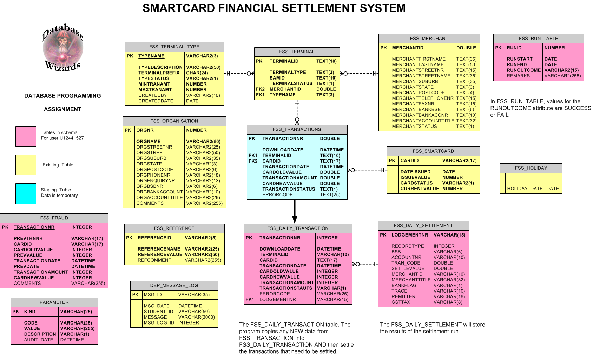
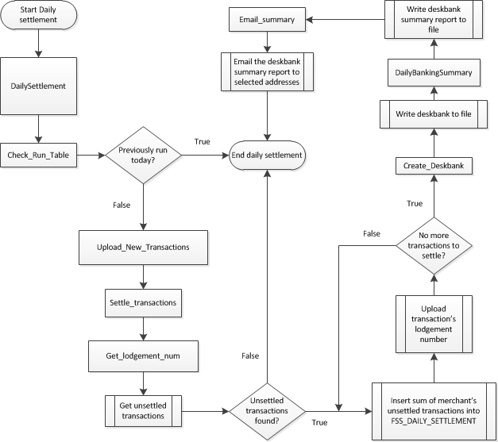
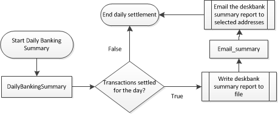
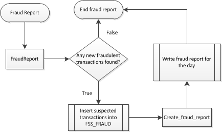
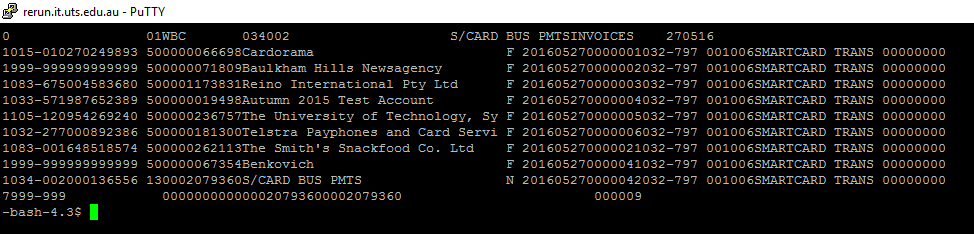
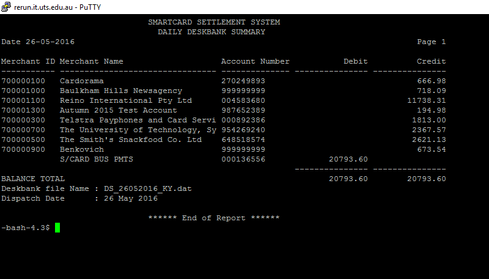
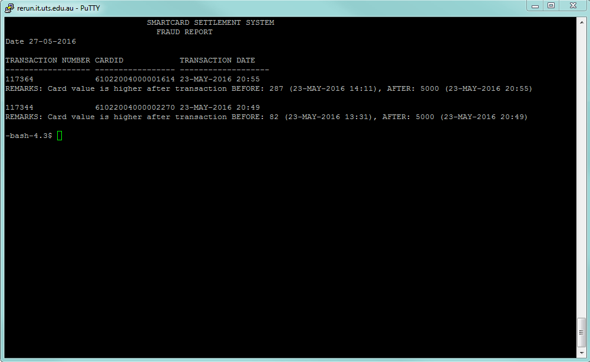

# Smartcard Settlement System

Smartcard Settlement system written in OracleSQL for the assignment of the subject Database Programming at UTS. <http://handbook.uts.edu.au/subjects/31253.html>

## Introduction

This is the design document for the Smartcard Financial Settlement System (FSS) for a Smartcard Transaction Centre, and this document will detail the creation of the system will explain and how it will be made how it will work.

Previously for the smart card system, various terminals are deployed and operated by merchants. Once a week, merchants were reimbursed by cheques for payments made by the smartcards. Settlements were calculated manually and merchants were not charged a fee for the smartcard transactions. The new system will automate settlements daily by reimbursing via direct credit into the merchant's bank accounts. The merchants will be charged a monthly fee for the smartcard, which will be a percentage of the transactions done in the month.

The purpose is to write the daily settlement system for the smartcard system, and the associated report it produces automatically. The system is entirely written in Oracle PL/SQL language. The document will cover the creation of the daily settlement, deskbank file, deskbank summary report, and the fraud report only.

## Definitions, naming conventions, and abbreviations

- FSS – file settlement system
- Module – refers to a function or procedure used in the program
- Deskbank file - banking file that will be known as a Deskbank file. The Deskbank file will be sent to the designated banking organization electronically. The Deskbank file, when run in the banking system will contain information necessary to credit the merchants bank account with the amount collected by the Smartcard transactions. The total of the deposits into the merchants' accounts is to be offset by a debit from our working bank account. The total of the deposits and the debits is to reconcile to zero. The format of the filename is: DS_DDMMYYYY_KY.dat where DDMMYYYY is the date of settlement.
- Daily Settlement Report – This report will be used by the business unit and will show the banking details generated by the Daily Settlement. The report will be created automatically when the deskbank file is produced, however your system should be flexible enough to allow the manual creation for a given settlement date.
- Fraud Report – The security department's role is to maintain the integrity and the validity of the Smartcard system. The report is to list all those cards and the associated transactions where there is suspicion of fraud.
- RUN Table – The FSS system will run each day and should settle all those transactions that have not yet been settled. You are asked to create and maintain a RUN table which should keep track of the run dates, the processing date ranges and the status of each run. The production support personnel will use this table to assist them in monitoring and maintaining the system in the event of failures. The run table is checked so the program is run once a day
- Lodgement number/ref – A number used to keep track of settlements, combination of the day of settlement and followed by a unique number (YYYYMMDDxxxxxxx, where YYYYMMDD is the settlement date, and the following x's is a unique number e.g. 201605280000007)
- Processing Date – The date and time that the transactions were processed and the deskbank file was produced
- Transaction Code – Code in the settlement used to flag if it is a debit or credit settlement. The values are either 13 or 50\. 13 is the code for a deposit into the nominated account, 50 is the code for a withdrawal from the nominated account.

The program will have the following naming conventions for the modules:

Module                | Name
:-------------------- | :---------------------------------------------------------------------------------------------------------------------------------------------------------------------------------
Package               | Pkg_FSS_Settlement – holds the modules for the smartcard settlement system.
Daily Settlement      | DailySettlement – this module handles the settling of transactions made by the smartcards on the terminals. Explained in more detail in the "modules" section below
Daily Banking Summary | DailyBankingSummary(DD-Mon-YYYY).txt – this is the summary for debits and credits made by the merchants for the stated day
FraudReport           | FraudReport – This report lists all of the suspicious transactions made by the smartcards, and inserts the transaction number, card id, and the date of the suspected transaction.

# FSS modules

The main components of the application are • The Daily Settlement • A report to identify any potential fraud • System control using a RUN table Whenever a module is run, it is logged by the common.log procedure, including any errors the program encounters during run time. The daily settlement is stored in the package PKG_FSS_SETTLEMENT and consists of three main modules (with a number of sub-modules):

Module                | Name
:-------------------- | :----------------------------------------------------------------------------------------------------------------------------------------------------------------------------------------------------------------------------------
`DailySettlement`     | The purpose of this procedure is to calculate all of the unsettled transactions, to credit merchants for transactions made by the smartcards. Calls smaller modules to achieve this. This procedure is set to rum every day at 7pm.
`DailyBankingSummary` | Takes a date parameter to generate the daily settlement report generated for that date, run when doing the daily settlements but can also be executed independently.
`FraudReport`         | Looks for any suspicious transactions and generates a report listing all possible fraud. This is done by comparing the card's previous values, since the cards cannot be re-charged, the card is flagged to be suspicious.

The following modules exists on the package body, and can only be accessed by the procedures listed above:

<table>
<tr><th>Module</th><th>Name</th></tr>
<tr>
  <td>`upload_new_transactions`</td>
  <td>Downloads new transactions from FSS_TRANSACTIONS and adds them to FSS_DAILY_TRANSACTION table. The lodgement number has a corresponding merchant ID, and the FSS_TERMINAL table contains the merchant's terminal IDs'. This way the lodgement number can find the terminal ID's in FSS_DAILY_TRANSACTION table. Then lodgement numbers flagged null are updated.
  <pre>
  UPDATE FSS_DAILY_TRANSACTION trn
     SET trn.LODGEMENTNR = p_lodgementnum
   WHERE EXISTS (SELECT p_merchantid
                   FROM FSS_TERMINAL ter
                  WHERE trn.TERMINALID=ter.TERMINALID
                    AND ter.MERCHANTID=p_merchantid
                    AND trn.LODGEMENTNR IS NULL);
  </pre>

  Parameters `p_lodgementnum`, `p_merchantid` are lodgement number to insert and the matching merchant ID respectively
  </td>
</tr>
<tr>
  <td>`Check_run_table`</td>
  <td>Checks run table to see if program has been run, exits if it has been run the same day, exits if run previously. If no successful runs were found for the day, then procedure will insert the run start into `FSS_RUN_TABLE`.</td>
</tr>
<tr>
  <td>`settle_transactions`</td>
  <td>Finds all unsettled transactions from the table `FSS_daily_transaction`, and calculates the total amount to settle (and other relevant data) to each merchant to `FSS_daily_settlement` table to settle, and then the program creates a deskbank file. If the settlement amount is below the total settlement value as specified in the `FSS_REFERENCE` table, it will not be settled. Here is where the majority of the work is done. The procedure checks the daily transaction table for a lodgement number, and skips them if one exists.</td>
</tr>
<tr>
  <td>`get_lodgement_num`</td>
  <td>a function with no parameters to generate and return a unique lodgement number for the day. Uses a sequence to get the unique number</td>
</tr>
<tr>
  <td>`upload_lodgementnr`</td>
  <td>Procedure takes a lodgement number and a merchantid, and finds the corresponding transaction and inserts the lodgement number by finding the terminal belonging to the merchant./td>
</tr>
<tr>
  <td>`debit_transaction`</td>
  <td>Procedure takes a parameter, the sum of all credit for the day (which ergo, will be the total amount to debit) and inserts the amount to debit into the table `FSS_DAILY_SETTLEMENT`. The entity to debit from will be the organisation, stored in the `FSS_ORGANISATION` table.</td>
</tr>
<tr>
  <td>`debit_transaction`</td>
  <td>Procedure takes a parameter, the sum of all credit for the day (which ergo, will be the total amount to debit) and inserts the amount to debit into the table `FSS_DAILY_SETTLEMENT`. The entity to debit from will be the organisation, stored in the `FSS_ORGANISATION` table.
  <pre>
  SELECT ORGACCOUNTTITLE,
         ORGBSBNR,
         ORGBANKACCOUNT
    INTO v_title,v_bsb,v_account_no
    FROM FSS_ORGANISATION
   WHERE ROWNUM<2;      
  INSERT INTO FSS_DAILY_SETTLEMENT (RECORDTYPE,
                                    BSB,
                                    ACCOUNTNR,
                                    TRAN_CODE,
                                    SETTLEVALUE,
                                    MERCHANTTITLE,
                                    BANKFLAG,
                                    LODGEMENTNR,
                                    TRACE,
                                    REMITTER,
                                    GSTTAX,
                                    SETTLEDATE)                                        
                            VALUES (1,
                                    v_bsb,
                                    v_account_no,
                                    13,
                                    p_debit,
                                    v_title,
                                    'N',
                                    v_lodgementnum,
                                    '032-797 001006',
                                    'SMARTCARD TRANS',
                                    '00000000',
                                    sysdate);
    </pre>
  </td>
</tr>
<tr>
  <td>`create_deskbank`</td>
  <td>This procedure handles the actual writing of the deskbank file. The deskbank file is formatted `DS_DDMMYYYY_ky.dat`, where DDMMYYYY indicates day, month (in number format), and year the deskbank file was created respectively. The lines of the report are hardcoded.</td>
</tr>
<tr>
  <td>`Format_currency` </td>
  <td>a function that accepts a number, converts the number into a dollar format (decimal places for cents) and returns it as a VARCHAR2 (e.g. takes 100560 cents as an integer, returns 1005.60 as a VARCHAR2)</td>
</tr>
<tr>
  <td>`Email_summary`</td>
  <td>searches the `PARAMETER` table for emails to send the deskbank summary reports, accepts a date parameter (the same one accepted in `DailyBankingSummary`) and finds the deskbank report created for the day as an attachment.</td>
</tr>
<tr>
  <td>`Create_fraud_report`</td>
  <td>procedure finds any transactions in the `FSS_FRAUD` table, if there are, then it will write a file listing the suspicious transactions (and why they are suspected to be fraudulent).</td>
</tr>
</table>


The following modules are called in almost all of modules.

Module       | Name
:----------- | :------------------------------------------------------------------------------------------------------------------------------------
`announceme` | takes a string and writes to common.log procedure to log what module is currently being run. Called at the beginning of every module.
`run_failed` | this procedure is called whenever an exception is thrown at run time logs to the run table that the run has failed
`common.log` | this procedure exists in DBP_admin and accepts a VARCHAR2 as parameter to insert into a log table (DBP_message_log).

The package contains a single global variable:

`v_run_ok` – Boolean variable, set to TRUE whenever execution starts and if the run_failed procedure is called, it is set to false. This is so whenever the program writes to the run table, this variable is checked to indicate if the run went smoothly.

The program uses the following sequences:

Module                | Name
:-------------------- | :----------------------------------------------------------------------
`FSS_SEQ_LODGEMENTNR` | Used in the function get_lodgement_num to get a unique lodgement number
`FSS_RUNLOG_SEQ`      | Used in the runlog table to get a unique number for the run id.

Procedures `DailySettlement`, `DailyBankingSummary`, and `FraudReport` are located in the package specifications and can be accessed publicly, while the rest of the modules are stored in the body and can only be called by the public procedures.

## Tables

The `Pkg_FSS_Settlement` exist on user `U12441527` schema, as does tables the `FSS_DAILY_TRANSACTION`, `FSS_DAILY_SETTLEMENT`, `FSS_RUN_TABLE`, and `PARAMETER`.

- `FSS_DAILY_TRANSACTION` – holds all of the day to day smartcard transactions captured by the terminals. The rows are copied from FSS_TRANSACTIONS table from the DBP_ADMIN schema. The table contains the column LODGEMENTNR, which if null indicates unsettled transactions, the lodgement number is the date of settlement followed by a unique number. Also included is the where the transaction took place (TERMINALID), and how much for (CARDOLDVALUE, TRANSCATIONAMOUNT, and CARDNEWVALUE).
- `FSS_DAILY_SETTLEMENT` – Table contains all of the settled transactions by the FSS system. Unique row is the lodgement number -`FSS_RUN_TABLE` – logs the runs made by the program. Has the start and end dates, the outcome (success or failed), and the remarks or comments of the run.
- `FSS_FRAUD` – contains the list of all transactions suspected to be fraudulent.
- `PARAMETER` – this table contains a list of emails to send out the daily settlement reports as attachments to.

Package runs are logged into the `FSS_RUN_TABLE`, which keeps track of the run dates, the processing date ranges and the status of each run. Additionally, when settling the program will only check transactions without lodgement number (which are unsettled transactions) in order to avoid settling transactions twice. The rest of the tables are located in the DBP_ADMIN schema. ERD shown below:



## Execution

In order to settle the daily transaction, the program executes the following modules in the following order:



If error is encountered in any of the modules, `run_failed` is called.

To find unsettled transactions this query is used:

```sql
CURSOR c_merchant_totals IS
       SELECT m.MERCHANTBANKBSB bsb,
              m.MERCHANTBANKACCNR act,
              SUBSTR(m.MERCHANTLASTNAME, 1, 32) Name, --Deskbank file only accepts 32 chars so note the SUBSTR
              M.MERCHANTID merchantid,
              SUM(t.TRANSACTIONAMOUNT) total
         FROM fss_merchant m JOIN fss_terminal term ON m.MERCHANTID = term.MERCHANTID
         JOIN FSS_DAILY_TRANSACTION t ON term.TERMINALID = t.TERMINALID
        WHERE LODGEMENTNR IS null  --Settled transactions have the lod gementnr stamped pick up only those that have to be settled
        GROUP BY m.MERCHANTLASTNAME, M.MERCHANTID, m.MERCHANTBANKBSB, m.MERCHANTBANKACCNR;
```

The `WHERE` clause omits any records with a transaction number, which indicates unsettled transactions.

In order to get the daily settlement report, the DailyBankingSummary procedure is run, either once the deskbank report is generated or independently (using the following SQL command):

`EXEC Pkg_FSS_Settlement.DailyBankingSummary`

To get the daily banking summary, the `DailyBankingSummary` procedure calls the following modules:



Fraud report is executed independently using the following SQL script:

`EXEC Pkg_FSS_Settlement.fraudreport`

Fraud report calls the following modules:



The query used in finding fraudulent transactions is:

```sql
CURSOR c_cards IS
      SELECT LAG(trn.TRANSACTIONNR, 1) OVER (ORDER BY trn.CARDID, trn.TRANSACTIONDATE) prev_trn,
              trn.TRANSACTIONNR,       
              LAG(trn.CARDID, 1) OVER (ORDER BY trn.CARDID, trn.TRANSACTIONDATE) prev_card,
              trn.CARDID,
              LAG(trn.CARDOLDVALUE, 1) OVER (ORDER BY trn.CARDID, trn.TRANSACTIONDATE) prev_val,
              trn.CARDOLDVALUE,      
              LAG(trn.TRANSACTIONDATE, 1) OVER (ORDER BY trn.CARDID, trn.TRANSACTIONDATE) prev_date,
              trn.TRANSACTIONDATE,
              trn.TRANSACTIONAMOUNT,
              trn.CARDNEWVALUE
         FROM FSS_TRANSACTIONS trn
    FULL JOIN FSS_FRAUD fr ON trn.TRANSACTIONNR = fr.TRANSACTIONNR
        WHERE trn.TRANSACTIONNR <> DECODE(fr.TRANSACTIONNR, NULL,0) -- Omit previous fraudulent transactions where
           OR trn.TRANSACTIONNR <> DECODE(fr.PREVTRNNR, NULL,0);
```

The values are compared from the previous transactions to see if any of them are suddenly "recharged".

## Deskbank file

The program runs once a day, and when there are transactions to settle, the package will generate a deskbank report. The deskbank report contains all of the transactions (credit and debit) for that day. It contains the merchant’s name and banking details, when it was settled and how much was settled. The file naming format is: DS_DDMMYYYY_KY.dat (where DDMMYYYY is the date of file creation in number format). The values of the deskbank file are hardcoded.



The table `FSS_DESKBANK_REF` contains the values to format the deskbank file (How many spaces between data, which values are hardcoded, from tables, or programmed).

## Deskbank summary report

The daily deskbank summary report is created when the deskbank file is created. The report is the same as the deskbank report, but it is made to be much easier to read by humans. The report is automatically emailed to addresses flagged in the `PARAMETER` table



## Fraud report

The fraud report is run separately from the daily settlement. The fraud report is written to the directory and lists all fraudulent.



All transactions suspected fraudulent are also stored in the FSS_FRAUD table.
